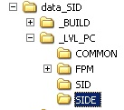
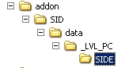

# **Star Wars Battlefront II – Jedi Creation**

**(and a bit about sides…)**

**by Someone Who Left Out All The Important Bits**

_Special Note:_

_I will be avoiding all avoidable Star Wars references throughout this guide - not once will I refer to you as Young Padawan, for example. Can't stand that stuff._

**Contents:**

**1 – Introduction**

**2 – Creating Your Own Side: The Basics**

**3 – A Jedi: Components and the Character ODF**

**4 – A Jedi Weapon ODF (Y&#39;know, Those "Light"…Thingies…)**

**5 – The Combo File**

**6 – Final Notes**

**1 – Introduction**

Hmm, it seems someone has gotten ahead of himself…I thought I heard somewhere that you want to create a Jedi. Well, then you've come to the right place, Young Pada…..ha, gotcha. In order to create a Jedi, or any other soldier, you will have to do a few things: First, you will have to create a side for your Jedi to be part of, or if you have already created your own side, you will have to add the REQ files for a new character. Then you will have to create the basic character for your Jedi - this means making sure everything important is included in the side, such as textures, models, and animations. It also includes learning about cloth and tentacles – or perhaps you owned a Dress-Me-Up Squid™ as a child and already know all about both of those topics. Then you craft your Jedi's weapon, force powers, and moves - or more likely you steal them from other Jedi, since you, like me, don't have a clue how to animate! Unlike a "real" Jedi, this process doesn't include a years-long quest for finding some type of crystal or other, sleeping outside under the stars and drinking nothing but Venti Lattes – no foam, soy milk and just a hint of cinnamon, and I swear if you put regular milk again in I&#39;m going to have my severe gastrointestinal reactions in your face, you hear?!

Ahem.

Let's get started, dudette. Soon you will be just as confused as I am.

**2 – Creating Your Own Side: The Basics**

This assumes you already have a world in which to work – preferably one created by VisualMunge, which has a "Worlds" folder and an "addme" folder and all that chunky goodness.

First thing you need to do is create a "sides" folder. **Into that folder, copy the "Common" folder from within the mod-tool "assets/sides" directory.** _ **Note that this is NOT the same folder as "assets/common", this is "assets/sides/common"!** _This folder is necessary because it contains all the things that are used by every side in the game – the default soldier class, default effects and lightsaber meshes, and other things.

Then you must create a sub-folder in that with the name of your side – it is not limited to 3 letters, I think, but I will keep with that convention and name my side "JDI". Within your side folder, several new folders must also be created. These are: effects, munged, msh, odf, and req. As shown:


What's the point of all these folders? They contain things specific to your side, not found in the Common folder…

- The Effects folder contains particle effects used by your side, such as explosions, powerups, and hit effects.
- The MSH folder contains assets used by your soldiers, such as .MSH files (models/geometry), TGAs (textures), and the associated .option files for those models and textures.
- The Munged folder contains munged animation data organized per skeleton, such as melee combo attacks, specialized weapon-firing animations, individual unit movement animations (walk/run/jump), etc. Don't worry too much about this yet.
- The ODF folder contains .ODF files ("Object Definition File") for your side's soldiers, weapons, ordnance, and other objects.
- The REQ folder contains .REQs, or requirement lists, for each unit on your side. A unit's REQ contains a list of the ODFs required or used by that unit, and additionally any textures, models, or effects not explicity mentioned in those ODFs. A REQ is used by the munge process when packing data into a .LVL file, so that everything required by that unit is sure to be loaded when that unit is loaded into a game level.

Whew. Now on to actually creating the files for your side.

_Step 1 – The soldier's ODF._

Off into the ODF directory we go. An ODF is a soldier's identity – it defines him (or her, to be fair), tells him (or her, to be fair) what he can do and what he (or she, tbf, okay I&#39;ll stop) can use, and generally IS that unit. For now, we don't need to have anything in it, we just need to make one so we can reference it in the other side-creation steps.

Let's decide on a name for our soldier – how about demojedi? Sure, that may not do it for you, and really I&#39;m not so keen on it either, but this IS a tutorial. So everything that has to do with this soldier will be derived from this name. Also, to prevent confusion, we will prepend the name of the side – so jdi\_demojedi is his name-o. Let's create his ODF, which is blank for now:

 

_Step 2 – The Soldier's REQ._

Now that the soldier exists, we must create a REQ file for him, in the "req" folder. So far, this REQ will only include the soldier's ODF, as that is all that must be included for the soldier to be loaded because the ODF directly references everything else – models, textures, weapons, etc. In some cases this may not be true, but generally a soldier's REQ only needs to include his ODF.

So then, in the req folder we create the REQ:

 

And what goes in it:
```
ucft
{
  REQN
  {
    "class"
    "jdi_demojedi"
  }
}
```

All REQ files must begin with "ucft", and each section is surrounded by curly braces {}. REQN is a section title, and it means require these things. The first line in a REQN section is the type of thing required – "class" means the files come from the ODF folder, and end in ".odf". So in this case, the REQ makes sure that "ODF/jdi\_demojedi.odf" is included in the side.

_Step 3 – The side's REQ._

In the base directory of your side goes the main side REQ, called "[side's name].req" – in our case, "jdi.req". This file will be a list of which REQ files from the req folder will be included in your final munged side LVL file. Suffice it to say, if a soldier is completely made and has a REQ in the req folder, but that REQ is not included in the side's REQ, that soldier won't be available to load in the game. The file:

 

And what's inside:
```
ucft
{
  REQN
  {
    "lvl"
    "jdi_demojedi"
  }
}
```

The "lvl" line means that the files that are included end in ".req" and comes from the "req" folder. Every .REQ file is munged into an LVL, with the soldier's LVL (jdi\_demojedi.req -\&gt; jdi\_demojedi.lvl) being included in the final side's LVL (jdi.req -\&gt; jdi.lvl). The side's LVL is what is actually loaded by the game, and sub-LVLs inside are accessed to load specific solder classes. You can look in the "assets/sides" folder to see how the shipped game's sides were organized.

_Step 4 –The side's munged-data folder._

This is the final step for creating the framework of your side. If you open up your mod's directory (in our case, data\_SID), then go into the \_BUILD folder, there should be a Sides directory. Inside this directory, we must create the folder where our side's munged data will go. It has the same name as our side's main folder ("JDI"), and you will need to copy the clean.bat and munge.bat from one of the other sides&#39; munged-data folders into it. Like so:


and then **copy \_BUILD/Sides/ALL/clean.bat and munge.bat** into that folder. **NOT clean.bat and munge.bat from \_BUILD/Sides – those are different!**

 

_Step 5 - All ready!_

At this point, you should be able to open up your mod's VisualMunge and see that in the "SIDES" box there is indeed a JDI side, ready and waiting to be munged. **Remember: the first time you munge, you must munge your world with the Common check-box checked, as well as the JDI side.** After that, if you change your side, you can un-check the Common check-box and just munge your side (and your world, but there's no escaping doing that).

If you do munge now, then it will create the folder "[your mod dir]/\_LVL\_PC" and inside that, "SIDES", and inside that it will place "jdi.lvl". At this point jdi.lvl has nothing in it, but this means the framework is set up correctly. Congratulations! That's the easy part. =^.^=

**3 – A Jedi: Components and the Character ODF**

**\*\*\*Important: If your text-editing application likes to insert curly quotes "" instead of straight quotes "", USE A DIFFERENT ONE. Curly quotes will break everything. We recommend Notepad (^.^) or Ultraedit. We de-recommend Microsoft Word and Wordpad.**

So, now we've got a blank ODF and we want to create a Jedi from it. MUCH of this section is going to assume you already have a model and texture and animations created, because creating those is outside the scope of this document. If you need, for learning purposes, feel free to "borrow" models and animations and things from one of the shipped game's sides. Personally I like the Wampa, but for a more human feel we're going to use Tatooine Luke (who was made, but never appeared in the game, unfortunately).

**Assets and ".option" files:**

For soldiers&#39; purposes, "assets" are models or textures, and they are generally placed in the "MSH" directory. Each asset can have an associated ".option" file – for example, if I have test.msh, then I can create test.msh.option as well. Option files are simply text files that contain various parameters to direct the munge process to treat those assets differently. For example, a MSH option file can contain "-nocollision", which will cause the munger not to generate collision for that mesh, or a TGA option file can contain "-maps 1" to direct the engine never to use a less-detailed mipmap for that texture. Soldier MSHs generally do have "-nocollision", and soldier TGAs generally do have "-maps 1", but there are many other parameters that option files can provide.

For a typical soldier, there is:

- A character model and texture – in our case all\_inf\_tatooinelukeskywalker.msh and .tga.

- A lowres model - all\_inf\_tatooinelukeskywalker\_low1.msh and .tga.

- And any other models and textures needed (lightsaber model and texture, in our case).

These assets are all placed in the MSH directory and are reference by the soldier's ODF, and various ODFs for weapons and other things. Which brings us to...

**A Soldier's (or a Jedi's) ODF**

**Note: For lots of things, there are Jet parameters. The only difference between a Jedi and a Jet Trooper (or Dark Trooper) is that a Jedi has a lightsaber as a weapon. If your soldier has a lightsaber, they will force-jump or Vader-style hover. If not, they will Dark- or Jet-Trooper-style jet-jump or hover. There is no way around this, although you can control the action type (jump vs. hover) and you can provide a different animation for each one.**

_The Basics:_

A Jedi ODF will ALWAYS begin with the following lines, which I have commented so they can hopefully be understood:
```
// any text following two slashes is a comment
// the section following [GameObjectClass] is for
// MUST include ClassParent, which is used
// by Battlefront 2 to determine which class
// this soldier derives from.
// Alternately to ClassParent, you may use
// ClassLabel = "soldier"
// however, the ODF for "com\_jedi\_default" sets up
// values we like, so we leave this class deriving from it.
[GameObjectClass]
ClassParent = "com_jedi_default"
// the Properties section defines everything else
// about the soldier
[Properties]

// which type of connections this soldier will follow
// on the AI path graph for the level
// - soldiers are generally "SOLDIER", but
// - those that can jet, jetjump, or forcejump are "HOVER"
AISizeType = "HOVER"

// Don't take damage from collisions with objects in the world
CollisionScale = "0.0 0.0 0.0" // x, y, then z scales

// the model (filename ends in .msh, and is located in the // MSH folder) to use for our character
// NOTE: Omit the .msh from the name!
GeometryName = "all_inf_tatooinelukeskywalker"

// the model to use for our character when he is far away
// (Generally this model is cheaper to render)
// if this line is not present the model will disappear
// when viewed from far away, and this geometry CANNOT
// be the same file as the high-res geometry!
GeometryLowRes = "all_inf_tatooinelukeskywalker_low1"

// the next line can be one of 3 choices:
// - Not included (blank), if the model wants to use the
// "human_sabre" skeleton and animations.
// (Those are Luke Skywalker's animations, but we
// will be defining our own so we are going to
// use this line anyway).
// - AnimationName if this model uses the basic human
// skeleton, but wants to provide its own animations
// as a set of files in the "munged" folder.
// - SkeletonName if this model wants to use its own
// skeleton in addition to its own animations.

// NOTE – if this model's animation set does not define
// an animation, such as "stand_walkforward",
// the default animation from the current weapon
// will be used instead. For example,
// if he is carrying a rifle, it will use
// human_rifle_stand_walkforward, and if he is
// carrying a lightsaber it will use
// human_sabre_stand_walkforward.
// For specialized additional animations
// such as melee attacks, they MUST be defined
// by this model's animation set.

// for the demo, we will be using the base skeleton
// but redefining SOME of the animations
AnimationName = "tat_luke"

// there may also optionally be a
// SkeletonNameLowRes or an AnimationNameLowRes
// if the low-res animations are different from
// the high-res ones...

// **** The following lines are the default Jedi parameters.
// They are fairly straightforward and usually not changed,
// so mess with them if you see fit.
// Force Jump ignores the Jet numbers and just uses the Jump
// numbers, but they still must be defined.
//The initial jump-push given when enabling the jet
JetJump = "10.0"
//The constant push given while the jet is enabled (20 is gravity)
JetPush = "0.0"
// for characters with jet jump, use this acceleration for
// in-air control
JetAcceleration = "10.0"
// the particle effect to show while jetting
JetEffect = ""
//Additional fuel per second (fuel is 0 to 1)
JetFuelRechargeRate = "0.0"

// optional, tells this character to hover (Darth Vader, Jet Trooper)
// versus jump (Luke Skywalker, Dark Trooper)
//JetType = "hover"
// Vader used JetFuel to control how long he can hover,
// even though it's not visible in the HUD

//Cost per second when hovering (only used for jet-hovers)
//(fuel is 0 to 1)
JetFuelCost = "0.0"
//initial cost when jet jumping(fuel is 0 to 1)
JetFuelInitialCost = "0.0"

//minimum fuel to perform a jet jump(fuel is 0 to 1)
JetFuelMinBorder = "0.0"

// display the meter for jet fuel, or don't display it
JetShowHud = 0

// How much Sprint energy to take away per jet activation or force-jump
JetEnergyDrain = 40.0

// the foley effects to use when walking around, falling, rolling, etc.
// generally this doesn't deviate from rep\_inf\_soldier,
// cis_inf_soldier, all_inf_soldier, imp_inf_soldier,
// or wok\_inf\_soldier (for Wookiees).
FoleyFXClass = "rep_inf_soldier"

// We are skipping the rest of the sound section (grunts, groans,
// hero voiceovers) for this guide.

// Tentacles and cloth go here, if any...
// (see below for an explanation of these lines)
ClothODF = "all_inf_tatooinelukeskywalker_cloth"

// Now for weapons – you can have up to 8 different weapons.
// Each one is defined in a WEAPONSECTION.
// Parameters include:
// - WeaponName – the name of the ODF that defines it.
//   This ODF can come from common, sides/common, or the side itself.
//   It can also come from a different side, but only if that side
//   is loaded before this soldier in your mission LUA. Otherwise,
//   BF2 will crash. :^)
// - WeaponAmmo – max number of ammo clips this weapon holds.
//   It will start with this much ammo. Zero is infinite ammo,
//   used for lightsabers and force powers and such.
//   (The amount of Sprint energy a weapon drains, and how much ammo
//   is actually in each clip are defined in the weapon's ODF.)
// - WeaponChannel = 1 //optional line
//   This line indicates that the weapon is part of the secondary
//   line of weapons (i.e. thermal detonators, force powers). It
//   will be activated by the Secondary Fire button or the
//   Force Power button, and the character will never be shown
//   carrying it, only using it.

// NOTE: "Bonus" weapons are equipped below as well, they lock or
// unlock themselves based upon Medal-status values set in
// the weapon's ODF.

WEAPONSECTION = 1
WeaponName = "jdi_weap_demo_saber"
WeaponAmmo = 0

WEAPONSECTION = 2
WeaponName = "com_weap_inf_force_push"
WeaponAmmo = 0
WeaponChannel = 1

WEAPONSECTION = 3
WeaponName = "com_weap_inf_sabre_throw"
WeaponAmmo = 0
WeaponChannel = 1

// this is the end of the ODF...
```

_ **Cloth…** _

In Battlefront 2, cloth is a way to make a polygon mesh distort itself in real-time based on gravity and wind and things. In layman's terms, it makes good looking skirts and capes. If your model has cloth on it, 
which our demo model does because Luke loves his skirt, then you will need to do 2 things to enable that cloth. (If you don't enable it, it will not appear in-game at all, which means you can see London, and you can see France…)

Firstly, you need to create a cloth ODF for the cloth, in the ODFs directory. The ODF name is simply the name of the cloth piece with ".odf" appended – in our case, "all\_inf\_tatooinelukeskywalker\_cloth.odf". Inside, you will find…

```
// \*\*\*\*\*\* A cloth ODF \*\*\*\*\*\*\*
// Top section, same as any other ODF
[GameObjectClass]
// this is cloth, so...
ClassLabel = "cloth"

// properties section – small for cloth
[Properties]

// This tells us the name of the model that the cloth piece is
// attached to. In our case, "all\_inf\_tatooinelukeskywalker"
AttachedMesh = "all_inf_tatooinelukeskywalker"
```

Secondly, in our soldier's ODF, you need to tell it that it uses this cloth ODF, which gives us this line in our ODF above:

```ClothODF = "all\_inf_tatooinelukeskywalker_cloth"```

And that's it! Assuming your artist did the right thing and attached the cloth where it needed to be, as well as put in cloth collision for it (XSI primitives in the .msh, named c\_whateverNameIWant) it should function.

_Note: A soldier may have as many cloth ODFs as you wish – each one simply needs to be referenced. One ODF must be created per cloth piece on the model, and they can each have different properties._

There are other properties that you may have in a cloth ODF – we have rarely had occasion to use them, but they are:

_(Note that [parameter] means a number, like 20.4, not [20.4])_
```
// ---list of optional cloth parameters---

// Angle of the wind, phi and theta
WindDirection = "[angle1 in degrees] [angle2 in degrees]"

// Wind speed, in m/s
WindSpeed = [speed]

// Dampening coefficient – in some unit or other :^) Default is 0.5
Dampening = [number]

// Drag coefficient, also in some unit – default is -2.0
Drag = [number]

// Mass of each cloth "particle" (in Kg?) – default is 1.0
ParticleMass = [number]

// Maximum world acceleration, in m/s/s – default is 20
MaxAcceleration = [number]

// Priority – cloth with lower priority is skipped,
// if not enough time is left this frame – used for the Emperor
// Default is 0
Priority = [number]

// Does this cloth have an alpha channel? 1 or 0, Default is 0
Transparent = [value]

// BF2 has 3 different types of constraints it satisfies each frame
// when computing the cloth:
// "Bend" constraints keep the cloth's shape.
// "Stretch" constraints keep the cloth's size.
// "Cross" constraints keep individual pieces of cloth from shearing.
// You can turn these on or off individually by specifying a
// zero for the constraint.
// For example, if you turn off "stretch" constraints the cloth
// can grow longer or shorter…
CrossConstraint = [zero or one]
BendConstraint = [zero or one]
StretchConstraint = [zero or one]
```

_ **Tentacles…** _

Well, "tentacles" is a misnomer. Technically, what these are is bones that are animated by the game engine (not the animator) according to physics and the model's movement. They can be used for hair (as on the Wookiee Warrior) or pouches that move (as on Chewbacca) or anything else you like…they can even be used to animate weapons.

Unfortunately, Luke is a plain old human, and he isn't too fond of hippie hairdos or long belts, so there are no tentacles in this example. But I will explain how they work, and encourage a look at the Wookiee Warrior or Ms. Secura as an edifying example. Actual implementation is left as an exercise for the reader.

Tentacles are pretty simple, really. The artist needs to include bones named bone\_string1 through bone\_string# (maximum is 45) and make sure they are in the base pose and properly parented to each other. Then you, the all-powerful demigod of character creation, need to tweak the soldier's ODF slightly:

Straight from Aayla (Aalya? I always forget…) we have:
```
// NumTentacles \* BonesPerTentacle = total bones, bone\_string1 to N
// Note that the max tentacles is 9, and the max bones is 5.
// However if you have one long tentacle, as long as the bone number
// ends up correct, that's okay too. So a 12-bone tentacle can be
// done as 4 3-bone tentacles and it will work fine.
NumTentacles = "2"
BonesPerTentacle = "3"

// TentacleCollType specifies which type of auto-generated collision
// the game should use. 0 is the one that works best, which is a
// sideways rectangular box centered around the shoulders.
// 1 and 2 are never used, but they are a sphere and a cylinder,
// respectively. Good luck with that.
TentacleCollType = "0"
```
And that's it!

_ **Note:** _ **If you want to test your Jedi, you can get rid of WeaponSections 2 and 3, and replace the weapon in WeaponSection 1 with "com\_weap\_inf\_fusioncutter", which is a weapon with no geometry or special things associated with it, that will enable your soldier to run around so you can see him. Check the Final Notes for information on how to munge your soldier.**

Now on to creation of the weapon, which is the important part…

**4 – A Jedi Weapon ODF (Y&#39;know, Those "Light"…Thingies…)**

Remember the line:

```WeaponName = "jdi_weap_demo_saber"```

from our Jedi's ODF? Well, the other two weapons – com\_weap\_inf\_sabre\_throw and com\_weap\_inf\_force\_push, found in sides/common – already exist, but now we have to make our Jedi's main weapon.

First thing you have to do is create the ODF, in our case jdi\_weap\_demo\_saber.odf in ODFs folder. (No picture this time, you better know where it goes by now!) You also need to place the geometry (msh) for the handle into the MSH folder. It is possible to create a lightsaber just attached to the character's bone, with no extra geometry – Darth Maul does this – but that is a black art. For the Wampa and the Acklay, extra invisible lightsabre geometry was actually created to guarantee the blade goes the correct direction, so we&#39;ll assume you have geometry. Different geometry is required for each hand (for example, Ms. Secura has two) since the blades go different ways, and the geometry must contain a hard point (called hp\_whatever) that you reference to determine where the blade comes from. If there are to be multiple blades, then there must be multiple hardpoints, because two blades coming from the same point of the same geometry will be considered the same blade.

In the case of this demo, I&#39;ll be stealing Luke's saber from the Alliance side, so I swiped all\_weap\_inf\_lightsabre.msh and .option and put them into our MSH folder. I also swiped the blade's texture, greenlightsabre.tga and .option.

Now, what goes into the ODF…?

```
[WeaponClass]

// this is always "melee" for a lightsaber
ClassLabel = "melee"
ClassParent = "com\_weap\_inf\_lightsaber"

[Properties]

// three parameters here:
// First, the parent animation bank – usually "human\_sabre" – this is
// where any animation that we didn't override will be taken from.
// Second, the parent weapon class – this is ALWAYS "melee".
// Third, the name of the combo file without the ".combo".
// What's a combo file? That's explained later, in its own section...
ComboAnimationBank = "human\_sabre melee jdi\_demojedi"

// If the weapon has an explosion associated with it, like Mace's
// or the Wampa, this is the name.
// In our case, there is an explosion just to demonstrate how to
// use one. Explosions are specified in ODFs – in our case,
// it's in jdi_demojedi_exp.odf.
ExplosionName = "jdi_demojedi_exp"

// How many blades – up to 4.
NumDamageEdges = 1

// From here on, everything is divided up, and the information for
// each blade is given separately. We only have one blade, but
// I will put in a second section that is commented out, just for
// show.

// The sabre's handle. We are terribly inconsistent with saber/sabre.
GeometryName = "all_weap_inf_lightsabre"

// The hardpoint in the geometry that the blade comes out from.
FirePointName = "hp_fire"

// ****NOTE****
// FirePointName can be replaced with OffhandFirePointName.
// What's the difference? FirePointName means that this
// geometry is attached to hp\_weapons on the model.
// OffhandFirePointName takes an extra parameter, which is
// which hard point or bone to attach this weapon to.
// The first argument is still the hard point in the weapon
// from which the blade emanates.
// For example, the line we used is the same as:
// OffhandFirePointName = "hp\_fire hp\_weapons"

// How long, in meters, the blade is.
LightSaberLength = "1.0"
// How wide.
LightSaberWidth = "0.25"

// Optional.
// Which texture to use, from the MSH folder, for the blade.
// Note that it is not required for the blade to have a texture,
// in which case all you will get is damage, like for the Wampa.
LightSaberTexture = "greenlightsabre"

// Optional.
// In RGBA format, the color of the trail left by this edge.
// Edges only leave trails when they can hit things / are attacking.
LightSaberTrailColor = "82 255 7 128"

// One thing we did use is a blade with no texture, but a trail.
// This was, among other things, used for Kit Fisto's punches and
// kicks.
// A blade with no texture and no trail was used for the Wampa and
// the Acklay – in fact, the Wampa has 3...

// The texture to use as the glow effect around the saber.
// This is generally left unchanged, because com\_weap\_inf\_lightsaber
// has a glow on it which is kept, but if we wish to get rid of the
// glow on our saber, we can specify "notexture".
// LightSaberGlowTexture = "notexture"

// And that's the end of the ODF! If we had more blades, we would
// repeat that section again for each blade. However,
// the 2nd, 3rd, and 4th weapons would use:
// OffhandGeometryName in place of GeometryName (same argument though)
// and OffhandFirePointName ALWAYS. FirePointName is only used once!
// Additionally - wow, hard to explain – if you want two blades to be
// part of the same weapon, do not specify the OffhandGeometryName for
// the second blade, just the OffhandFirePointName. See Darth Maul
// as an example.
```
And that's the end of the ODF. Almost. There's also a way to make a blade without all that nonsense, and with a whole new set of nonsense. If you just want a blade to come off a character's bone or hardpoint without creating your own geometry, you can do the following…please note that ONLY Darth Maul uses this, because he was one of the first Jedi created. This method is very difficult, and if you can, have an artist create your invisible handle instead.
```
// Rather than saying GeometryName and FirePointName, you can simply
// use the following ("simply", that is): AttachedFirePoint
// The first parameter is the bone name.
// The next 3 are the X, Y, and Z components of the direction
// that the blade extends, in bone-local space.
// The last 3 are the X, Y, and Z offsets from the bone's
// position, again in bone-local space.
// If you didn't understand any of that, then this is
// NOT something you want to use.

// Taken from Darth Maul. Create an edge extending from
// bone\_l\_calf down the X-axis of the bone, offset by
// 0.35 meters (the X-length of the bone, in this case).
AttachedFirePoint = "bone\_l\_calf 1.0 0.0 0.0 0.35 0.0 0.0"
```
Now that we're finished specifying the weapon and how it looks, it's time to make a combo file, which is where all the magic happens.

**5 – The Combo File**

Hopefully by now you really have become dedicated to finishing your character. I know I told you the rest of it was the hard part, but this is where the real pain begins. The combo system takes a little getting used to, a lot more getting to know, and a whole bunch of massaging to get it to do what you want. It has evolved over time from Combo, to Comba, and finally to Combaga, and the subsequent increase in power has led to many unstable situations. This section covers: the basic structure and organization of a combo file, and what the various parts do; specifics that you usually want to have; any and all parameters that can go into a state (unless I miss some), which ones have ended up being useful, which ones haven't, and how things are intended to be used; and final words to help you get your soldier running, jumping, attacking, and possibly even look cool while doing it - especially in multiplayer which has its own set of special requirements. While I will not be constructing an example combo file in this document, there is a completed one (hopefully with comments, unless I get lazy) in the ZIP that accompanies this document. Additionally, with the information in here, you should be able to construct your own…after all, that's what you're here for, right?

I have also included the combo-file document prepared by the first guy who worked on the combo system – it is incomplete now, and somewhat hard to understand, but there might be something there for you. :^)

The combo file is referenced by the weapon ODF, and goes in the ODFs directory – for this demo, it's "jdi\_demojedi.combo", and yes, they always end in .combo. As with all other ODFs, it's just a text file.

_ **Basics…** _

Righto, so what's this all for? Well, a combo file determines how your Jedi can react to particular inputs and situations, and which attacks occur when. If it's not in your combo file, your Jedi can't do it.

_ **If you don't know what the term "frame" means in relation to video games or animation, go look it up right now. This term is heavily used from here on out. In our game animations are played at 30 frames-per-second, so the time for one frame is 1/30** __ **th** _ _ **of a second.** _

The basic structure of a combo file is a list of states. Each state represents all (or part) of a particular animation that your character has. The state can tell your character that he can hit his opponent at a particular time or times, play a sound at a particular time, play your weapon's explosion, or do a bunch of other things. Each state can also switch (from here on, "transition") to another state depending on certain conditions, like the player pressing a button or your Sprint energy running out. States can also have special properties like laser-bolt deflection or altered gravity. These states are everything your character can do, and your character is always "in" exactly one of the states at a time. The way you set up the states and transitions determines which attacks your character can do when, and what happens when you do them.

If you need further explanation, you can look up a "finite state machine" (also called an FSM), because there are lots of examples of this sort of thing out there, and we have more important matters to deal with.

Your soldier MUST always have a state called "IDLE", which is the default state that he/she starts in. This is also the state which they return to if something goes wrong and BF2 can't figure out what to do. Think about it as: when you aren't doing anything special to a Jedi, you're in IDLE state. The IDLE state is the only state that does not have an animation defined for it - when your Jedi is in IDLE state they act as a normal soldier and can jump, run, sprite, crouch, Force Jump or Hover, roll, and do anything else a normal soldier can do. If you make a combo file with just an IDLE state, your Jedi will be able to do everything except attack and block. However, when the conditions are met for a transition from IDLE state, these override the normal soldier actions – so you can tell your soldier to do something different when you press the Jump button from IDLE state, but if you don't then they will jump normally.

_ **Animations…** _

Right. So. You want to make a soldier, but you want to use your own animations. This is a multi-part process, and really should have gotten its own section, but we're already here, so here we go…

**How do they work?**

There are basic sets of soldier animations (human\_rifle, human\_tool, human\_sabre, human\_bazooka and some others I may be forgetting). "human" is the um, class I think, and "rifle" or "sabre" or "bazooka" is the weapon type. These define many animations, for example \_stand\_idle\_emote which is the basic standing-around animation. Each animation set defines its own variation, so there is human\_rifle\_stand\_idle\_emote, human\_sabre\_stand\_idle\_emote, etc.

There are also \_full, \_upper, and \_lower that you can tack onto the end of an animation, which tells BF2 that this animation applies to the whole body, only the top, or only the bottom, respectively. For our purposes all animations will be "\_full". **YOU MUST include "\_full" at the end of the name, otherwise \_upper is assumed.**

So for example, there is human\_sabre\_stand\_idle\_emote\_full, which is Luke's idle animation, and there is human\_sabre\_stand\_walkforward\_full, which is Luke's walking-forward animation. Note that there are walk, run, and sprint – on PC, with no analog stick for walking, all you ever see are run (maximum speed without the Sprint key) and sprint forward, and walk backward. There are also things like human\_sabre\_stand\_attack1a, and \_attack1a\_end. These are Luke's attacks, and the basic fallback attacks for other Jedi.

**Overriding animations...**

For a new animation set, there must be a parent animation set. In our case, this is human\_sabre. Any animation that the new animation set has will be used. However, any animation that is needed, but which the new animation set does not define, will be taken from the parent set. So for example, if our new animation set doesn't have a stand\_idle\_emote, then human\_sabre\_stand\_idle\_emote will be used. Hopefully this is clear. Our new animation set can also add unique animations, for example you could add \_myattack\_that\_I\_made\_it\_is\_awesome\_full and use it from your combo file, even though there is no human\_sabre\_myattack\_that\_I\_made\_it\_is\_awesome\_full.

**Setting up an animation set…**

When you set up a new animation set, at least for a Jedi, the weapon type is still the same, "sabre"…so you will be replacing the "human" part of "human\_sabre" with your set's name. If you wanted to make Tatooine Luke, for example (wonder why I picked that one…) you could replace it with "tat\_luke", and all your animation names would begin with "tat\_luke\_sabre". (If you were making an animation set for a character whose weapon uses the rifle animation set instead, then it would be "tat\_luke\_rifle", see?)

The first step to setting up your animation set is to create a folder for it. In your mod's "data" folder, there should be a folder called "Animations", containing a folder called "SoldierAnimationBank", containing a folder called "template". What you must do is make a copy of that "template" folder and call it whatever your new animation set will be named. And since you copied the folder, there should be a "munge.bat" batch file inside it. Like so:

 

Unfortunately, you must edit munge.bat so it will munge your animations to the right directory. So, open it in Notepad (remember to make it non-Read-Only if you have to!) and you should see something like this:

@call ..\munge\_animation.bat "/keepframe0 /dest aalya.zaf" Sides\REP

The bits you need to change are the "aalya.zaf" and the "Sides\REP". The first one is the name of your new animation set (for us, "tat\_luke") and the second one is the destination directory (which in our case is "sides\JDI\munged" but it automatically adds "\munged", so it's just "sides\JDI"). Like so:

@call ..\munge\_animation.bat "/keepframe0 /dest tat\_luke.zaf" sides\JDI

Save it, and that's that. When you add or remove animations from your animation set, you need to double-click this batch file to run it which updates the animation-set files the game uses. We&#39;ll get to that in a minute.

If you have the "assets" folder, which contains the entirety of the animations we used for BF2, then you can see what goes into an animation set. Basically, there's a basepose.msh, which is keyframed on frames 1 and 0, and sets up the skeleton and what is included in it. Then there are individual animations, animSetName\_weaponType\_animation\_name\_full/upper/lower, animated as normal (I suppose, according to our animator).

Since this is a tutorial, we will be stealing Luke's animations and putting them into our own animation set, which – even though it won't look any different from human\_sabre, will be our own to expand on as we wish. So first we steal Luke's basepose and stand\_idle\_emote\_full, and put them into our folder. Remember to rename the beginning to "tat\_luke" or whatever your set is called:


_All that is really necessary for your animation set is a basepose.msh. This determines what your skeleton looks like – for example, the Wookiee and Ewok use human animations, and have only different skeletons, meaning their animation sets consist of simply a basepose (and specialized extra animations if they have any)._

Now that your set has a basepose and an animation, if you double-click munge.bat, it should create some log files, and 3 files that BF2 uses for your animation set in \sides\JDI\munged:


You can open the .anims file in Notepad, and it will list what animations are defined by your set:
```
ucft
{
  ANIM
  {
    "tat_luke_sabre_stand_idle_emote_full"
  }
}
```
The name of the files that were created ("tat\_luke.anims", etc) is what is used in your soldier's ODF (AnimationName = "tat\_luke"). Keep in mind that these files and your animation set need to have the same name – if "tat\_luke.anims" has inside it obiwan\_sabre\_stand\_idle\_emote\_full, this animation will not be able to be used by the game.

That's all for creating animations – as you add or remove animations in your set, you need to re-run munge.bat in order to recreate those files in your side's \munged folder. Then you need to run VisualMunge again and munge your side. Those 3 files are eventually copied into your side's .LVL file and loaded by the game.

Keep in mind that you only need to re-run the animation munge.bat if you change your animation set – changing your soldier's ODFs or combo file doesn't require you to do that.

_ **The Combo File Header…** _

Each combo file begins with the same information, before we get to the state-definition part. The usual commented example:
```
// The name an animation is always just the part after
// the class and weapon, because the class comes from your
// soldier ODF, and the weapon comes from the type of weapon
// that the animation is playing on – for the demo,
// the class and weapon are always tat\_luke\_sabre.
// You may also omit the _full/_upper/_lower, unless you
// explicitly need to use \_lower. I always leave off \_full.

// When declaring that an animation exists, you can do so
// with just one line:
// Animation("anim_name");
// but this animation will have default parameters.
// In order to reference an animation, you have to have
// declared that it exists. So if you want anim A to blend to
// anim B, you need to declare that both exist, then define
// A a bit more. Hopefully that's clear too, because it's done
// below.
// To further specify an animation, you can add descriptors:

// Loop(); done this way, the animation will loop as it plays,
// restarting from the beginning.
// The default is not to loop.
// You can also use Loop("FinalFrame"); which will continue to loop
// the last frame of the animation forever when it is reached.
// FinalFrame is the useful one. :^)

// Most of the rest of the parameters are explained in combo.txt...

// OffhandAnimation defines an animation that replaces weapon use
// animations. For example, replacing the FIRE, FIRE2 or CHARGE
// animations with our own animations when a character has
// this lightsaber equipped means that, for example,
// we can replace the FIRE animation with a force-using
// animation, that the weapon will then play instead of
// rifle firing. FIRE and FIRE2 are the 2 animations a weapon
// can use – look at com_weap_inf_force_pull or _push for
// an example (the "FireAnim =" line).

// If you are replacing FIRE and FIRE2 or CHARGE, they MUST
// be replaced IN ORDER or FIRE will override everything else.

OffhandAnimation("stand_useforce", "FIRE")
{
    Loop("FinalFrame");
    AimType("Torso");
    BlendInTime(0.15);
    BlendOutTime(0.15);
}
OffhandAnimation("stand_useforce", "FIRE2");
OffhandAnimation("stand_useforce", "CHARGE");
```
For the rest of this, due to time constraints I will simply be including notes that go along with combo.txt, or things that are not included in combo.txt.
```
// Sabre-throw stuff....
// This is the animation to use when we throw the sabre.
// human_sabre_stand_throw_full is present by default, so
// everyone uses that.
ThrowAnimation("stand_throw");

// If you have sabre throw as a weapon, you MUST
// have a CATCH_SABRE state. This is a state like
// any other, but it is automatically entered when
// your character catches the sabre. Normally
// it's just a state that plays the catch animation
// then goes back to IDLE.
State("CATCH\_SABRE")
{
    Posture("Stand");
    // Sound("saber_catch");
    Animation("stand_catch")
    {
        AimType("None");
        BlendOutTime(0.2);
    }
    InputLock("All", "!Thrust");
    AlignedToThrust();
}
```
**Additional Notes – These Are Important! (In no particular order)**

- Generally, ground moves are NOT AlignedToThrust, and jumping moves are. Sprint moves may also be aligned, but if they are not you have greater control – see Ki-Adi-Mundi's sprint attack.

**- Gravity() does NOT work in Multiplayer…**

**Use GravityVelocityTarget(number, "Impulse"); instead. Also note that ZeroGravity DOES NOT WORK at all.**

- PlayExplosion happens on the first frame of the state.

- **The posture you are in for a given state is actually the real action** – if it is Crouch, your collision is crouched. If it is Sprint, you will move forward and drain energy. If it is Jump (the useful one) your character will jump if he is standing. If it is Roll, you will start a roll then be forced back to IDLE state – there is no controlling a character during a roll. Posture Jump is a way to get your soldier to jump from a standing position.

- Normally, states can be entered and exited on the same frame – for example, if you transition to a state that is in Jump posture, then has a transition on posture "Stand" to landed, you will go through both right away and be in "landed" state because your character never jumped. In this case, put "MustShowOneFrame();" in the Jump state, so that one frame goes by and the character actually jumps.

- Edge(0) Edge(1) etc are in the order they are defined in the weapon ODF – if you add a new edge and it changes the order, all these must be updated.

- Push(number); applies a push of that much force to the soldiers you hit with the attack. Generally 3 is light, 6 is medium, 10 is large and 15 is very large. Push may or may not produce a visible effect on the other person depending on what they are doing at the time, and where they are in relation to you. No push = no hitstun.

- Some transitions may not work in multiplayer. To get a transition to work in multiplayer, here's an example:

Say you have an animation that is 25 frames long, and if they hit a button you want to go to another state at the end of it. Make a state that is 25 frames in Duration, and transition to the other state at frame 23. Make the transition end at frame 24 (remember, the state ends at frame 25). This will always be able to be used in multiplayer – other methods of timing-out your transitions may not be.

- If state A uses animation DoStuff, then goes to state B that also uses animation DoStuff, the animation will NOT restart, unless RestartAnimation(); is in state B. A side-effect of this is that all time-related things are related to the TOTAL time the animation has been playing, meaning: If state A is 10 frames long, and you want something to happen on the 5th frame of state B, then that has to happen on the \*15th\* frame, not the 5th, because by then the animation has been playing for 10 frames already. Hopefully this is clear. This also applies to the Duration of state B - if state A is 10 frames long, then state B is 25 frames, instead of 15, because it's the total time, see?

- **\*\*\*For some stupid reason, if you say "Reload" as a button in the combo file, that's the SecondaryFire/Force Power button in-game. If you say FireSecondary, that's the Block button in-game. Get used to it! So doing a secret attack is a matter of transition on the press/hold/doubletap of Reload, NOT FireSecondary!\*\*\***

- Putting in "secret" attacks is simply a matter of transitioning to some state on the Press of a different button, or the Hold or DoubleTap of the attack button. (^.^) Check Darth Maul for an example.

- I would do pretty much everything in "Frames", it's easier than in seconds.

- I like the way blocking works on the PSP, so I've designed the demo character to block by hold/release of the block button, rather than tap. This also means not having to worry about breaking out of block by attacking and things, simplifying our state table.

- The demo character has a secret attack.

- If you use an animation that has the same name as something that already exists in human\_sabre (for example, attack1a), then you CANNOT redefine the parameters (Loop, BlendTimeTo etc) for it! Therefore, if you want to do this, make sure your animations are named something unique. This is a bug.

- The infinite-block glitch is fixable by adding some transitions to your Deflect state. This has been left as an exercise to the reader. (^.~)

- If your character has secondary weapons (Force powers, etc), then you cannot use the Secondary Fire button as a condition of transitions from IDLE. You can, however, use it from any other state – so from Attack1 you can go to SecretHiddenAttack if they press the Force Power button ("Reload" in the combo file, remember…) – BF2 used this quite a bit. This limitation is because if you have a secondary weapon it will activate if you are in IDLE state, and "eat" the input of that button. Also note that if you don't have any secondary weapons, you are free to use this button from IDLE – meaning you can do cooler stuff, but don't get to have force powers.

- If a state is an AnimatedMove, this means that the full body animation is always used – if not, then if the character can walk around and the player does move them, the legs will become a walking animation. Therefore, AnimatedMove() with zero Z and X velocity, and normal walking speed VelocityFromThrust (12) and VelocityFromStrafe (3-8) can be used if you want a full body animation to play. An example is most characters&#39; third attacks – the first two will be overridden by walking legs if the player moves, but the third attack is a kind of a grounded jump, so we use AnimatedMove() to make sure the legs play and the character will always perform the jump part. AnimatedMove() is also used in the air to ensure that the legs aren't playing the jump animation.

- A lot of times, you will notice a Jedi die and still complete their attack sequence with the sabre off, before collapsing. This is because there is no transition out of that attacking state to IDLE, therefore the state finishes playing. Due to constricted memory pools on the consoles, lots of these transitions had to be left out. If you wish to fix this, simply have a transition to IDLE if the character's Posture is not what the state sets it to. For example, if your state is Posture("Stand");, then if you have a transition to IDLE if Posture("!Stand");, then the character will exit that state properly when they die. Some states of the demo jedi include this to demonstrate.

- A melee weapon locks-out use of the secondary weapons from a given state if that state has InputLock() in it. Generally, InputLock("All", "!Thrust") is used because the soldier still wants to know about our thrust, but only the melee weapon wants to know about all the other buttons. If you do NOT lock FireSecondary, then the user can press Force Power and interrupt that state with a secondary weapon. An example of this is in normal BF2, if you select Luke and switch to Force Push, do his 3-attack combo, and hold down the Force Power button during the third attack, he will interrupt the end of the third attack (state RECOVER3, not state ATTACK3) into Force Push. This was an oversight, the InputLock line from RECOVER3 was accidentally deleted so it can be interrupted in that manner. (^.^) So, don't do this in your Jedi unless you want to because you think it's neato.

I apologize for this part of the documentation, but after all there is an example combo file in the JDI side, and many in the assets folder. Please remember to ask any further questions on the [www.gametoast.com](http://www.gametoast.com/) forums, and I&#39;m sure it&#39;ll find its way to me. Making combos is an art, so just keep poking around until it does what you want. =^.^=

**6 – Final Notes**

When you munge now, "jdi.lvl" should contain your character. How do you use it in the game? Well, so you know, it's in the SIDE folder of your mod's \_LVL\_PC folder. When you munge, this gets copied into your BF2 directory automagically…

 is copied to your BF2 directory's 

ending up with



From there, in your mod's mission scripts, you can load your character into your level:

```ReadDataFile("dc:SIDE\\jdi.lvl", "jdi_demojedi")```

_The "dc:" tells the game that this lvl file is located in your mod's folder, rather than in the normal game data folder. The first parameter is the side's lvl file to open, and the rest are individual soldiers to load from within that side's lvl – in our case jdi\_demojedi, and if we had made one, jdi\_otherdemojedi or jdi\_demojedi2, etc…_

Now all you have to do is set your teams up to use that soldier, and ba-zam you're done. So on to that….

Both of these should already be present with the default hero and soldiers in your mission LUA scripts, but:

**Note: Once a soldier class (ex. "jdi\_demojedi") is loaded by ReadDataFile, it can be used on ANY team. It doesn't matter where the soldier comes from, you can mix-and-match Republic soldiers and CIS soldiers on the same team if you decide to, as long as all the soldier classes you use are actually loaded.**

To set your Jedi up as a team's hero, use the following line:

```SetHeroClass([team], "hero_req_name")```
for example:
```SetHeroClass(REP, "rep_hero_macewindu")```
or:
```SetHeroClass(CIS, "jdi_demojedi")```

To set your Jedi or soldier up as a normally-selectable or points-unlocked soldier on a team, modify the SetupTeams section of your mission LUA and replace an ODF name with your own soldier's loaded ODF name:
```LUA
SetupTeams{
    rep = {
        team = REP,
        units = 20,
        reinforcements = 150,
        soldier = { "rep_inf_ep3_rifleman",9, 25},
        assault = { "rep_inf_ep3_rocketeer",1, 4},
        engineer = { "rep_inf_ep3_engineer",1, 4},
        sniper = { "jdi_demojedi", 1, 4},
        officer = {"rep_inf_ep3_officer",1, 4},
        special = { "rep_inf_ep3_jettrooper",1, 4},
    }
},

--[then CIS section]
```
}

For a more complete description of what the SetupTeams or SetHeroClass functions do, please see the LUA guide that's supposed to have been written by someone else. (^.^)

**Extra console commands:**

Useful console commands when debugging a Jedi are:

- "combo.damage" – toggles on and off the showing of a Jedi's saber edges that can do damage as a red bar with a sphere at the end. The bar indicates the length, while the sphere indicates the radius. Note that this is the Length and Width that come from within the Attack() sections of a combo file, NOT the length and width from the weapon ODF.

- "anim.show" – toggles on and off display of the animation(s) that the player character's legs and upper body are playing, the total length of the animation (in frames) as well as the current frame number, and the percentage of blending out of the last animation. ESPECIALLY useful with:

- "slowmo [number]" (like "slowmo 5"). The number is the number of times slower to play the entire game…um…it's the denominator in the speed, so if you say "slowmo 5" then the game plays at 1/5 speed, if you say "slowmo 2" then it plays at ½ speed, etc. "slowmo" by itself, or "slowmo 1" turns it off. Note that you can also speed up gameplay with "slowmo .2" or "slowmo .5", but this has no practical use for animation debugging. After inputting a "slowmo", turn off the console and check your character for bugs or animation pops.

**Well, that's the end.**

Hope you learned something.

May the Fo…um….Good luck!
