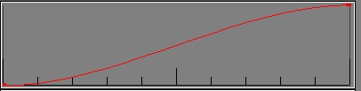

# **PROCEDURAL ANIMATIONS**

# **in ZeroEditor**

**by Your Archenemy, Mike Z**

**Edited by Joe Shackelford**

- **What is a Procedural Animation?**

A procedural animation (PA) is a way of defining movement for any static object. It is designed to add more life to levels.

A PA is a series of keyframes: a keyframe stores either a position or a rotation (in degrees), and a time (in seconds). Position and rotation are considered separate, so there does not need to be a both a position and rotation keyframe at any given time. (You can usually consider the position and rotation animations to be separate from each other.) The object moves between keyframes as time progresses, and this creates an animation.

A simple example:

A position keyframe at (0,0,0) with time = 0, and another at (10,0,0) with time = 10 sec. When played, the object will move smoothly from (0,0,0), through (5,0,0) at 5 sec, to (10,0,0) at 10 sec., and will stay at (10,0,0) from then on. If the animation is set to Loop, then the object will return to (0,0,0) right after 10 sec. and the animation will repeat.

- **What can a Procedural Animation do?**

PA mode is a 90/10 function, meaning it can do 90% of the things that you want to fairly easily, and if it could do the extra 10% then it would take months to build. Therefore, what you CAN do with it is as follows:

- Move a static object any which-way over time.
- Associate an animation with the object that it acts upon.
- Associate many of ^ those pairs into an Animation Group.
- In-game play, pause, restart, and play sections of an Animation Group through events, as well as triggering other events and groups.

And what you CAN&#39;T do:

- Move regions or anything that isn&#39;t a static object.
- Move non-static objects (spawned fliers, players, bots.)
- Have fine-grained control of sound associated with animations.

**Contents:**

1. **The animation mode GUI**
2. **The Animation side menu**
3. **Keys, position, rotation, graphs and other confusing parts - creating a new animation**
4. **The Group side menu – creating a new animation group**
5. **Creating Hierarchies**
6. **In-game control through the awesome power of LUA**
7. **The Animation Mode GUI**

Click the well-hidden Animation Mode button

(at the bottom of the Object Mode menu) to enter Animation Mode:

To go back to Object Mode, either click on the Back To Object Mode button in the top-center, or click the Object Mode button (which is lazy and never moves from its usual spot.)

**Upon entering Animation Mode, all changes you make to objects (which are limited to moving and rotating them) are non-permanent, so when you save your world or Animation and then exit Animation Mode all objects are restored to their initial positions.**

## **The Helpful Display Options Menu**

This menu provides a few important functions:

**Show Path** – toggle display of the path of the object over the animation&#39;s runtime.

**Show Ghosts –** toggle on or off the &quot;ghost&quot; objects that show the object at various equally-spaced time intervals throughout the animation. For example, 2 ghosts = one at the start and one halfway through, 3 ghosts = one at the start, one at 1/3, and one at 2/3, etc.

**Ghosts Text Box –** enter the number of ghosts to be shown.

**Toggle Graph** – turn on or off the graphs of the objects X, Y and Z positions / rotations throughout the animation&#39;s runtime. Example graph of an object moving from (0,0,0) to (10,20,30) over 10 seconds – **NOTICE THE GRAPH LABELS showing different maximum values. Scaling can be confusing….**

## **II. The Animation side menu**

**The name of the currently selected animation.**

**The name of the currently selected object, if any.**

**Displayed frame&#39;s time in secs – text box / slider.**

**Total run time in secs – text box.**

**Loop and Local Translation buttons.**

**List of all existing animations.**

**Add new / delete current buttons.**

**Play or stop buttons for the currently selected animation.**

**Keyframe menus below for both position and rotation.**

**Add / delete a position or rotation key.**

**Listbox of keys showing what times they occur.**

**Text boxes for changing the time, X, Y or Z values for the currently selected position or rotation key. Position is in meters, Rotation is in degrees.**

**Type of transition to use from this key to the next key.**

**If the transition type is Spline, below it will appear 6 text boxes for deciding on your X, Y and Z slopes when leaving this key, and the X, Y and Z slopes when arriving at the next key. This is where the graphs are useful!**

**A little help with transition types:**

Below are some graphs from 0 to 10 sec, position going from 0 to 10, with a keyframe at each end. This shows what effect the different transition types have.

&quot;Pop&quot; type

&quot;Linear&quot; type

&quot;Spline&quot; type with slopes 0 (at first key) and 0 (at next key).

&quot;Spline&quot; type with slopes 3.5 (at first key) and 0 (at next key).

&quot;Spline&quot; type with slopes 0 (at first key) and 3.5 (at next key).

Spline type transitions are used to create smoother animations – just be sure to match the &quot;in&quot; slope at a keyframe with the &quot;out&quot; slope.

# **III. Keys, position, rotation, graphs and other confusing parts - creating a new animation**

What use would animation mode be without the ability to create new animations? Probably not much considering it&#39;s still useless even with that ability, so let&#39;s examine the steps to creating a new animation.

- First of all, click the Add button to create a new animation.
- Then give it a descriptive name so it can be referenced later.
- Finally, decide on a total run time and enter it into the Run Time box. Don&#39;t worry, you can change the run time later if you decide you want it to be different - but you can&#39;t edit an animation that doesn&#39;t have a Run Time.

Next, select the object you wish to use to create the animation. Please note that any object you want to animate **must have a name** , so if you are not in the habit of naming your objects, go name the one you want now before you try to animate it.

**\*\* NOTE: The positions that are recorded in keys are calculated relative to the position the object was in when you entered Animation Mode! In other words, if you enter Animation Mode and then move an object 10 feet and add a position key, that key will be (10,0,0) rather than (0,0,0). If you wish to move the starting point of an animation, move the object in Object Mode first!**

Additionally, it is probably a good idea to add both a position and rotation key at 0 seconds, as a starting point.

Now, the Time slider can move from 0 seconds to the end of the animation&#39;s runtime. If you have an object selected, moving the Time slider will move the object to its position at that time.

**To add a keyframe:**

- First, move the Time slider to the time at which you want the key, or type that time into the Time box.
- If you will be adding a Position key, move the object to the place you want it to be at that time, and click Add (under Position).
- If you will be adding a Rotation key, simply click Add (under Rotation). For reasons too confusing and boring to list here, Rotations must be entered manually. Remember that &quot;X&quot; means rotating around the X axis (i.e. pitch), Y is rotation around the Y axis (yaw), and Z is roll.
- Finally, you can manually adjust the X, Y, Z, and time values of any key by selecting the key and typing the values in. The changes are shown immediately if an object is selected, to help with entering Rotations.

After you&#39;ve added some keyframes, perhaps moving the object to a few positions using Linear transitions, you can click Play to play the animation from the current frame time through to the end. You can also use the Play From Start button to play your animation from the beginning of the timeline.

**Looping:**

If Loop is off (the default for any new animation), then once the animation reaches its final Run Time, the object will remain in its final position from then on. If Loop is on, then once the object passes the animation&#39;s final keyframe, it will transition back to the first keyframe using whatever transition is specified in the final keyframe. It is as if you had duplicated the first keyframe again at the end of the animation.

**Local Translation:**

Remember I said, &quot;position and rotation are usually considered separate&quot;? Well, this is the reason for the &quot;usually&quot;. If Local Translation is on, then the Position keyframes change depending on which way the object is facing. Consider the following example, where an object moves forward 10 units while rotating 90 degrees:

 With Local Translation off.  With LT on.

Thus, with Local Translation on, the direction an object moves is determined by its rotation. This is useful for animating spaceships, cars, and objects that continually move in one direction (&quot;forward&quot;) while turning.

**Hint:** Local translations can be difficult to wrap your head around. It helps to animate in pieces, doing position first to make a straight track, then go back and add rotations to make turns. For example:

- Decide how fast you want it to go. For example, if the animation is 30 seconds long and you want it to move at 10 meters per second, then it will have to move 300 meters total.
- Create a Position keyframe at 0 seconds, then create one at the end of the animation. Change the one at the end of the animation to reflect the **total** amount of movement - for example, (0,0,0) at 0 sec. and (300,0,0) at 30 sec. Thus the object will travel in a straight line at a constant speed
- Now, turn on Local Translation and simply insert Rotation keyframes at whatever times you want, to bend the &quot;track&quot;.
- You can create smooth variations in speed by using several Position keyframes connected by spline-type transitions.

1.
## **The Group side menu – creating a new animation group**

So by now you have created a bunch of nifty things that you want to happen in your level. If this is true, then this section is where you want to be.

An Animation Group is a set of animation/object pairs…Animation A on object A, Animation B on objects B and C, and so on. A Group can pair any animation(s) with any object(s), but the catch is that the objects must have been given names. So go back to Object mode and name the objects you need. :^)

Only Animation Groups may be played in-game, so this is where all the magic happens – the Animation Group panel.

This panel contains the Name of the currently selected group. Add/delete group buttons, and group list. Plays When Level Begins button. Play/stop currently selected group buttons. Add/delete an anim/obj pair from the current group. A list of paired names that reflect the object name and animation name. Edit the currently selected animation and object to be paired together.

So here&#39;s how you use this panel for your animations.

C  lick the top Add to add an animation group, and then give it a descriptive name.

Click the Animation/Object Pairs Add button to add an animation/object pair to the currently selected group. You must add a new pair before you can edit it.

Type in the name of an animation and the name of the object it will be played on. Capitalization doesn&#39;t matter, but make sure they are spelled correctly.

You can click the Play button to play the entire group and see what it acts like together. **NOTE:** You must have an **object with a name** selected in order to play a group. That&#39;s all there is to creating an animation group! When you have your groups created, you can move on to actually getting them to do things.

Groups that have Plays When Level Begins turned on will automatically play as soon as the level is loaded, meaning if all you&#39;re trying to do is add background animation, you&#39;re done now.

Stops when Object is Controlled is a button that allows you to toggle off the animation if the player or an AI unit enters that object causing it to switch sides. This was not used in the final game, but was intended to give spacecraft a subtle hovering/floating animation that would stop when a ship was entered and start again when the ship was exited.

1.
## **Creating Hierarchies**

When you are ready to start grouping objects in hierarchies, you&#39;ll want to check out the

aptly named Hierarchies panel in the lower right corner of the editor.

The Root Name is the parent object that will control the other children objects.

The Selected object is a text entry box that you use to enter the name of the child objects.

The Hier List is allows you to select the hierarchy you wish to work on.

The Obj List shows the children for a selected hierarchy

So how do you use this? Simple!

C  lick on the Add button below the Hier List, a new hierarchy will appear in the Hier List.

Click on the word Rootobj and type in the name of the parent object that is assigned in an animation group.

Next click the Add button below the Obj List and rename Obj 1 to the child object you want in the hierarchy. Remember that you&#39;re animating the parent object, so don&#39;t animate the child unless you want some crazy results. That&#39;s it! DONE!

Now, if you want the parent to be animated but the children to remain where they are (ie: animating a crane to pickup and box then drop it somewhere else) click the Disable Hierarchies button in the Animation Group panel and you can disable the parent children interaction between the objects only for that Animation Group.

If you want to do more, then go on to the Dreaded LUA in the next section….

::ominous music::

# **V. In-game control through the awesome power of LUA**

Assuming you know LUA syntax and how events work (which are NOT explained in this doc), there are a few event-related things you can do with animation groups.

**---- LUA functions ----**

**PlayAnimation(&quot;Animation Group Name&quot;)**

Resumes playing of an animation group from whichever time it was at last.

**PauseAnimation(&quot;Animation Group Name&quot;)**

Pauses the group&#39;s playback – objects remain where they are currently.

**RewindAnimation(&quot;Animation Group Name&quot;)**

Rewinds the group to the beginning. Can be called while the group is playing. If called while the group is stopped, play will resume from the beginning when Play is called.

**PlayAnimationFromTo(&quot;Animation Group Name&quot;, beginTime, endTime)**

beginTime and endTime are floating-point numbers, in seconds. Plays the indicated animation from beginTime to endTime. So for a 10-second animation, playing from 0 to 5 plays the first half, and playing from 5 to 10 plays the second half. See &quot;Animation Start Points&quot; below for more information.

**SetAnimationStartPoint(&quot;Animation Group Name&quot;)**

Takes the current positions of the objects referenced by the group, and uses those positions as the new start point for when that object is next animated.

**---- Animation Start Points ----**

When a level is loaded, the positions of all objects are captured, and those positions are used as the start points for animations unless SetAnimationStartPoint is called later. This is best demonstrated by an example.

Say an object is created at (0,0,0) on level load, and I have an animation group MyGroup that moves it 10 units forward on the X-axis. If I play the entire animation

PlayAnimation(&quot;MyGroup&quot;)

the object ends up at (10,0,0). Now if I stop the animation and play it again

PauseAnimation(&quot;MyGroup&quot;)

RewindAnimation(&quot;MyGroup&quot;)

PlayAnimation(&quot;MyGroup&quot;)

the **start point** has not changed, so the object will go **back to (0,0,0)** and move again to (10,0,0).

However, if I play the animation once, then SetAnimationStartPoint(&quot;MyGroup&quot;)

PlayAnimation(&quot;MyGroup&quot;)

-- wait 10 sec --

PauseAnimation(&quot;MyGroup&quot;)

SetAnimationStartPoint(&quot;MyGroup&quot;)

the start point is now the object&#39;s current position, (10,0,0). So, the next time I play the animation, it will go from (10,0,0) to (20,0,0). See?

**NOTE:** Start points are per-animation-group, so if I had a second animation group, MySecondGroup, that went 10 units up on the Y axis for this object, and I played it after playing MyGroup **and** after setting MyGroup&#39;s start point

PlayAnimation(&quot;MyGroup&quot;)

-- wait 10 sec --

PauseAnimation(&quot;MyGroup&quot;)

SetAnimationStartPoint(&quot;MyGroup&quot;)

PlayAnimation(&quot;MySecondGroup&quot;)

the object would go from (0,0,0) to (0,10,0), since the start point for MySecondGroup is still (0,0,0). To have them follow each other properly we need

PlayAnimation(&quot;MyGroup&quot;)

-- wait 10 sec --

PauseAnimation(&quot;MyGroup&quot;)

SetAnimationStartPoint(&quot;MySecondGroup&quot;)

PlayAnimation(&quot;MySecondGroup&quot;)

so that MySecondGroup starts at the end point of MyGroup.

This should be as complicated as animation LUA programming gets, because they are not designed for complex use.